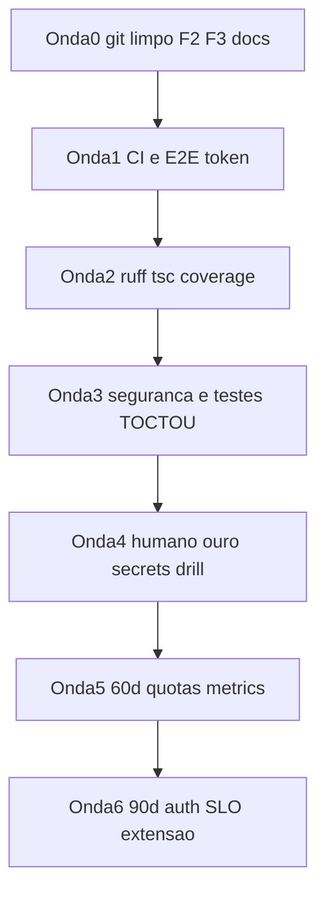

# Plano 30 / 60 / 90 — oportunidades E2E (25/09/2026)

**Overview:** implementar [oportunidades-melhorias-e2e-2026-09-25.md](../oportunidades-melhorias-e2e-2026-09-25.md) em ondas: primeiro git limpo + F2/F3, depois CI/qualidade, depois segurança/ops, e só então o que é humano (ouro, secrets, drill).

Piloto single-user. **Não** misturar stash `wip classificacao-padrao-publico`. **Não** tirar TCU da quarentena. **Não** segundo LLM no analyzer.

Mudança de política: `memory.md` dizia para não religar CI. O documento de oportunidades **pede CI mínimo**. Este plano religa só o gate leve (pytest SQLite + ruff + tsc/lint/build + eval seed). Sem `e2e_live` no GitHub (cota LLM).



## Checklist

- [ ] Onda 0: commits F2 copiloto, F3 smoke-retry, docs; merge FF em `main`; tag `e2e-2026-09-25`; status limpo
- [ ] Onda 1: religar `ci.yml`; ruff em `requirements-dev`; `e2e_fast.sh` + doc com `source .env` e fail-fast `API_TOKEN`
- [ ] Onda 2: pre-commit ruff; inventário de 21 supressões; `cov-fail-under=70`; congelar 300+ LOC no `memory.md`
- [ ] Onda 3: headers unificados; testes duplo-start e readyz mismatch; `mem_limit`/`cpus` no worker; lock ingestão; `GIT_SHA` na imagem FE; docs auth + checklist de rotação
- [ ] Onda 4 (Bruno): re-run ouro 09-ti-pabx-nuvem; evidência 1.1; rotacionar secrets; `git log --all -- backups/` vazio
- [ ] Onda 5 (60d): restore-drill evidenciado; persistir `/metrics`; recall@5 como gate de embedding sob demanda
- [ ] Onda 6 (90d): decisão auth; SLOs no Painel; extensão isolada/testada; TODOs em issues; Redis/K8s só com pedido

---

## Onda 0 — git reprodutível (P0 1.2 + P1 2.4 + 2.5)

Working tree em `feat/copiloto-ux` (HEAD = `main` `7846070`). Três commits **separados**, depois FF em `main`. Sem o stash F5.

1. **F2 Copiloto** — incluir só chat:
   - [frontend/src/components/chat/ChatCopilot.tsx](../../frontend/src/components/chat/ChatCopilot.tsx) (Dialog `min(96vw,1100px)`)
   - `AssistantAnswer.tsx`, `chatAnswer.ts`, `answer_sanitize.py`, `test_chat_answer_sanitize.py`
   - diffs de `prompts.py`, `sources.py`, `validator.py`, `ChatMessage` / `Panel` / `CitationList`
   - Aceite: pytest chat verde; rebuild frontend; Perguntar no centro; resposta sem UUID / `estrutural:failed`.
2. **F3 smoke** — só [scripts/smoke_readyz.sh](../../scripts/smoke_readyz.sh) (retry 10×2s) + nota em [deploy.md](deploy.md): após `--build` o Next pode atrasar 20s.
   - Aceite: `./scripts/up.sh --build` + smoke verde de primeira.
3. **Docs de auditoria** — [scripts/contexto-auditoria.sh](../../scripts/contexto-auditoria.sh), [.cursor/contexts/auditoria-e2e-falhas.md](../../.cursor/contexts/auditoria-e2e-falhas.md), ponteiros em `e2e-full.md` / `vibecoding.md` / `memory.md`. Manter `docs/auditoria*` se já existirem. **Não** commitar `.env` nem `backups/`.
4. `git status --short` vazio (exceto o que Bruno marcar como local). Tag `e2e-2026-09-25` em `main` após o merge.

---

## Onda 1 — CI mínimo + E2E copiável (P0 1.1 + P1 2.6)

Arquivo morto: [.github/workflows/ci.yml.disabled](../../.github/workflows/ci.yml.disabled) (já tem backend ruff+pytest, eval seed Postgres, frontend).

1. Renomear para `ci.yml`. Ajustar jobs:
   - Backend: `pip install -r requirements.txt -r requirements-dev.txt` · `ruff check app tests` · `pytest tests/test_init_sql.py tests -q` em SQLite (`conftest` já força). **Não** rodar `e2e_live`.
   - Eval: manter `--seed --check-baseline` contra `eval/baseline.ci.json`.
   - Frontend: `tsc --noEmit` · `next lint --max-warnings 0` · `next build`.
   - Documentar que `e2e_fast` local exige token (não no GHA sem secret).
2. [backend/requirements-dev.txt](../../backend/requirements-dev.txt): garantir `ruff` + `pytest-cov`.
3. [e2e-full.md](e2e-full.md): todo comando copiável vira:

```bash
set -a && source .env && set +a
test -n "${API_TOKEN:-}" || { echo "API_TOKEN vazio"; exit 1; }
E2E_BASE_URL=http://127.0.0.1:8000 PYTHONPATH=backend:e2e/tests \
  pytest e2e/tests -m e2e_fast -v --tb=short
```

Opcional: wrapper `scripts/e2e_fast.sh` com o mesmo fail-fast.

Aceite: PR com teste quebrado ou ruff vermelho não mergeia; copiar-colar da doc passa com `.env` válido.

---

## Onda 2 — enforce qualidade (P1 2.1 + 2.2)

1. Pre-commit: `.pre-commit-config.yaml` com `ruff` (preferir `ruff check` sem rewrite massivo no primeiro PR).
2. Inventário dos 21 `noqa` / `as any` / `@ts-ignore`: [supressoes.md](supressoes.md) (criar). Remover os gratuitos; o resto vira issue.
3. Congelar 300+ LOC no `memory.md`: próxima feature em `rag/loader.py`, `evidence_gate.py`, `rag/semantic.py`, `api/documents.py` **extrai** módulo. Sem refactor especulativo agora.
4. Coverage: `pytest --cov=app --cov-fail-under=70` no CI backend (depois 80). Golden FakeLLM permanece porta de prompt (precision ≥ 0,88 / recall ≥ 0,80).

Aceite: CI vermelho se cobertura &lt; 70 ou ruff/tsc/lint falhar.

---

## Onda 3 — segurança e operação testável (P1 2.7 + P0 1.3 / 1.4 docs)

Código:

- Unificar headers entre [backend/app/utils/security.py](../../backend/app/utils/security.py) e [frontend/next.config.js](../../frontend/next.config.js). HSTS + `Cross-Origin-*` só com TLS de staging — **não** no HTTP local.
- Teste duplo-`start_analysis` em [backend/app/api/analysis.py](../../backend/app/api/analysis.py) (`with_for_update`): duas tasks no mesmo `document_id` → um job (ou segundo 409/202 idempotente). Postgres no teste ou skip SQLite com motivo.
- Teste `/readyz`: `expected_schema_version` ≠ `schema_meta` → 503 ([backend/app/main.py](../../backend/app/main.py)).
- Compose worker: `mem_limit` + `cpus` em [docker-compose.yml](../../docker-compose.yml) (ex. 1g / 1.0).
- Lock de ingestão: job único `ingest_*` (não paralelo). Sequencial no runbook.
- Frontend image: `ARG GIT_SHA` / `NEXT_PUBLIC_BUILD_SHA` no Dockerfile + label; `up.sh --build` passa `--build-arg`.

Docs (Bruno assina; agente só redige):

- [auth-piloto.md](auth-piloto.md): token operacional, validade, donos; multiusuário = OIDC+RBAC+trilha por ator (fora).
- Checklist de rotação em [piloto.md](piloto.md): `GROQ` / `GEMINI` / `POSTGRES_PASSWORD` / `API_TOKEN` + data; `git log --all -- backups/` vazio.

Aceite: testes novos verdes; `/metrics` 401 sem token (revalidar em staging); checklist sem secret no git.

---

## Onda 4 — humano (P1 2.3 F1)

1. `git status` limpo + imagens rebuildadas a partir de `main` pós-Onda 0.
2. Reenviar `fixtures/trs-codeba/piloto-unico/09-ti-pabx-nuvem.pdf` em modo econômico.
3. Item 1.1: sem `[prazo]` / `[quantidade]` e sem omissão Art. 6 (a) se 1.4 / 4.3.2 / 11.5 tiverem o fato.
4. Evidência (print) + `pytest tests/test_analysis_precision.py -q` verde.
5. Atualizar [gate-piloto-14d.md](gate-piloto-14d.md) e `memory.md` item 13.

---

## Onda 5 — 60 dias (P2 início)

- Backup drill com evidência: [restore-drill.md](restore-drill.md); gravar data/resultado em [piloto.md](piloto.md).
- Quotas worker e lock de ingestão: já na Onda 3.
- Recall@5 como gate de embedding: job CI **manual**/agendado (não a cada PR) contra `eval/baseline.piloto.json` (piso 0,90). Não reabrir 5–8 sem regressão.
- Dashboard mínimo: persistir `/metrics` fora do processo (hoje zera no restart). Sem Prometheus obrigatório neste passo.

---

## Onda 6 — 90 dias (P2 resto)

- Decisão: piloto continua token **ou** OIDC/RBAC + trilha por ator. Sem OIDC até o Bruno pedir.
- Publicar SLOs de [slos.md](slos.md) no Painel.
- `extension/`: manifesto + teste de sanitização no CI **ou** repo separado.
- Redis / K8s / fine-tune: só com decisão explícita.
- 37 TODOs: issues com dono; `scripts/legacy/` para `migrate_*`; Alembic único caminho.

---

## Ordem no Agent

Quando pedir “execute”: Onda 0 (commits F2 → F3 → docs → merge `main` → tag). Depois Onda 1. Depois Ondas 2 e 3 em PRs separados. Onda 4 é checklist humano. Ondas 5–6 não começam no mesmo PR.

Arquivos que mais mudam no curto prazo: `ci.yml`, `requirements-dev.txt`, `e2e-full.md`, `smoke_readyz.sh`, `docker-compose.yml`, `security.py` / `next.config.js`, testes em `backend/tests/`, chat no working tree.
