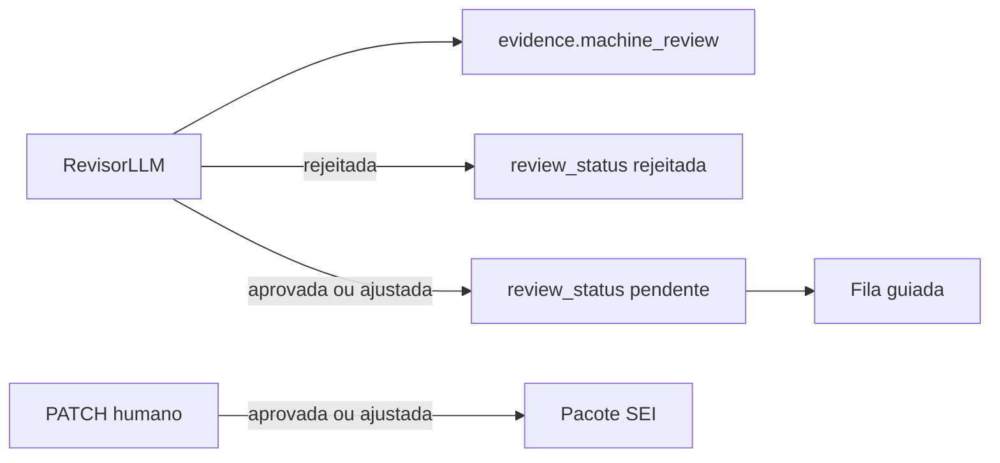

# Correção da auditoria do piloto (28/09/2026)

Corrigir o bloqueante da auditoria (revisão automática gravando o mesmo status que libera o SEI) e, na mesma branch, os bugs altos e os furos médios que têm correção local. Sem reabrir o golden v2, sem ligar miss-hunter e sem chave paga.

Branch nova a partir de `main`: `fix/auditoria-sei-humano`. Não commitar sem pedido. Frontend sem bind mount: depois das mudanças de UI, validar com `./scripts/up.sh --build`.

Fora desta branch: reabrir o golden v2, ligar miss-hunter, bump de dependência, CI, Next 15, consulta ao volume do Postgres para HNSW.

## 1. SEI só com aprovação humana

Hoje o revisor LLM grava `review_status` em [backend/app/services/analyzer/review.py](backend/app/services/analyzer/review.py) (`apply_review_decisions`, linha 242). O pacote SEI aceita `aprovada`/`ajustada` em [backend/app/api/analysis_filters.py](backend/app/api/analysis_filters.py) e [backend/app/services/analyzer/corrected_document.py](backend/app/services/analyzer/corrected_document.py). A fila em [frontend/src/components/analysis/GuidedReview.tsx](frontend/src/components/analysis/GuidedReview.tsx) só mostra `pendente`.

`evidence` já é JSON. Sem migration.

Em `apply_review_decisions`:

- `aprovada` da máquina: `review_status` permanece `pendente`. Gravar `evidence["machine_review"] = "aprovada"` e a nota em `evidence["machine_note"]`. Não preencher `reviewed_at`.
- `ajustada` da máquina: aplicar `suggested_text` / `justification` (o humano precisa ver o texto corrigido), mas status continua `pendente`. `evidence["machine_review"] = "ajustada"`. O `evidence["para"]` gravado na persistência já guarda o texto anterior.
- `rejeitada` da máquina: manter `review_status = "rejeitada"` (fora do SEI e da fila) e prefixar `review_note` com `Revisor automático:`.
- Jurídico alto sem decisão válida: continua `pendente` e fora da lista `kept` do score desta rodada (comportamento atual do teste `test_review_decisao_status_invalido_nao_aprova`).
- Jurídico alto que a máquina “aprovou”: também fica `pendente` e fora do score até o PATCH humano. É a mudança de nota esperada.

O PATCH humano em [backend/app/api/analysis_review.py](backend/app/api/analysis_review.py) segue sendo o único escritor de `aprovada`/`ajustada`.

Atualizar [backend/tests/test_analyzer.py](backend/tests/test_analyzer.py): `test_review_aprova_e_rejeita`, `test_review_ajustada_atualiza_texto_sugerido` e `test_review_data_utc_marcada_apos_decisao` passam a exigir `pendente` + `evidence["machine_review"]` na aprovação/ajuste, e `rejeitada` só na rejeição automática. Acrescentar um teste de filtro SEI: correção com `machine_review=aprovada` e status `pendente` não entra em `for_sei=True`.

## 2. Undo devolve o texto

[backend/app/api/analysis_review.py](backend/app/api/analysis_review.py) (linhas 55–59) só grava `suggested_text` quando o status novo é `ajustada`. O undo em [GuidedReview.tsx](frontend/src/components/analysis/GuidedReview.tsx) (linhas 169–172) manda o texto anterior com status `pendente`, e a API ignora.

Gravar `suggested_text` e `justification` sempre que o payload trouxer valor não nulo, em qualquer status. Aprovar sem esses campos continua intacto ([CorrectionReviewActions.tsx](frontend/src/components/analysis/CorrectionReviewActions.tsx) não envia texto no aprovar). Teste em [backend/tests/test_correction_review_api.py](backend/tests/test_correction_review_api.py): `ajustada` com texto novo, depois PATCH `pendente` com o texto antigo, e o banco volta ao texto antigo.

## 3. Honestidade dos números

Em [frontend/src/lib/confidence.ts](frontend/src/lib/confidence.ts):

- Precisão: “Ainda não medida no golden v2”.
- Recall: “Não medido — Postgres do piloto com zero análises em 28/09”. Sem o 0,25 na frente. O 0,25 (3/12) fica só na frase de histórico, marcado como harness v1.
- Cobertura: “435 backend · 47 frontend” (o arquivo hoje diz 41).
- Histórico: golden v2 (3 TPs + 18 tripwires; 17 pendentes rejeitados 0/17). Groq R 0,56 continua como sintético, não como precisão atual.
- `status` do recall: `ausente`, não `harness`.

[frontend/src/components/report/ReportOpinion.tsx](frontend/src/components/report/ReportOpinion.tsx): o botão deixa de dizer “Copiar Parecer para o SEI”. Rótulo: “Copiar parecer”. Uma linha acima do texto: o parecer não é o pacote SEI e inclui achados ainda não aprovados. O pacote continua no botão da análise.

[frontend/src/app/confianca/page.tsx](frontend/src/app/confianca/page.tsx) linha 45: o mesmo par de cores de [ReportScores.tsx](frontend/src/components/report/ReportScores.tsx) linha 63 (`text-amber-950` no claro, `dark:text-amber-200`).

[frontend/src/components/analysis/AnalysisProgress.tsx](frontend/src/components/analysis/AnalysisProgress.tsx) linhas 22–24: se `total_items` ≤ 0, não usar divisor 1. Mostrar “cobertura indisponível” e não marcar o estágio “Pronto”.

## 4. Quarentena TCU com “nº”

Em [backend/app/services/rag/quarantine.py](backend/app/services/rag/quarantine.py) (regex linhas 32–36), aceitar `nº` / `n°` / `n.` opcional entre o nome e o número. Estender [backend/tests/test_rag_quarantine.py](backend/tests/test_rag_quarantine.py) `test_sanitize_legal_basis_e_parecer` com “Súmula nº 247/TCU” e “Acórdão nº 1214/2013” → `None`. “Art. 47 da Lei 14.133/2021” continua passando.

## 5. Alínea no item pai

Em [backend/app/services/parser/structurer.py](backend/app/services/parser/structurer.py), ao fechar a validação (linhas 184–189), se o número é uma letra e existe pai numérico (`4.3.4`, `2.1.3`), gravar `4.3.4.a` em vez de `a`, `a-1`, `a-2`. Sufixo `-N` só se essa chave ainda colidir. Teste novo em [backend/tests/test_structurer.py](backend/tests/test_structurer.py): duas listas `a)`/`b)` sob pais diferentes não geram `a-2` nem `b-3`.

## 6. Sigiloso acha o Ollama do host

Defaults em [backend/app/config.py](backend/app/config.py) linha 54 e [docker-compose.yml](docker-compose.yml) linhas 73 e 155:

- `OLLAMA_BASE_URL` default `http://host.docker.internal:11434` (não existe serviço `ollama` no Compose; o host já entra por `extra_hosts`).
- `OLLAMA_MODEL` default `qwen3:8b`, como no `memory.md`.

Não mudar `APP_ENV` para `staging` (isso esconde `/docs`). Fechar o furo do override em [backend/app/services/privacy.py](backend/app/services/privacy.py) linhas 72–80: `_dev_cloud_override` só vale com um segundo flag, `LLM_DEV_CLOUD_OVERRIDE`, default `false`. `LLM_ALLOW_CLOUD=true` sozinho deixa de mandar `NULL`/sigiloso para a nuvem. Documentar os dois em [.env.example](.env.example). Teste ao lado dos de [backend/tests/test_rag_privacy.py](backend/tests/test_rag_privacy.py): `development` + `LLM_ALLOW_CLOUD=true` + override off continua bloqueando sigiloso.

## 7. Cota e medição

- Em [backend/app/services/analyzer/analysis_phases.py](backend/app/services/analyzer/analysis_phases.py) `_run_supervisor_rereview`: se `budget_truncated`, não chamar o LLM (o miss-hunter já pula nesse caso). A chamada de [engine.py](backend/app/services/analyzer/engine.py) linhas 206–209 passa o flag.
- Não ligar `MISS_HUNTER_ENABLED`. Não alterar lote no código: o default do Compose já é 1. Passo manual no `.env` local, se estiver 5: `ANALYSIS_BATCH_SIZE=1` ou `2`.
- [backend/scripts/benchmark_offline.py](backend/scripts/benchmark_offline.py) linhas 91–100: se não houver correções, sair sem escrever. Se escrever, substituir a seção daquele `analysis_id` em vez de acrescentar, e o cabeçalho fala golden v2 / carimbo feito — não “carimbo humano pendente”.

## Verificação

- `PYTHONPATH=backend backend/.venv/bin/python -m pytest backend/tests/test_analyzer.py backend/tests/test_correction_review_api.py backend/tests/test_rag_quarantine.py backend/tests/test_structurer.py backend/tests/test_rag_privacy.py backend/tests/test_supervisor.py -q`
- `cd frontend && npx tsc --noEmit` e os testes de `confidence` se existirem asserts dos textos antigos (hoje [frontend/src/lib/confidence.test.ts](frontend/src/lib/confidence.test.ts) só cobre `isStale`).
- Não re-medir recall: o Postgres do piloto está com zero análises.
