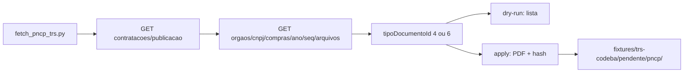

# Plano: captura de TRs públicos no PNCP (28/09/2026)

Caminho **A** da estratégia de dados: baixar Termos de Referência e Projetos Básicos **já publicados** da CODEBA via API pública do PNCP. Sem SEI, sem senha, sem Selenium, sem LLM.

Contexto: o piloto não tem pessoas para enviar TRs; o Bruno tem acesso ao SEI, mas a raspagem do SEI ficou de lado. O PNCP cobre só o que já foi publicado (vantagem de conformidade). Minuta interna continua fora deste spike.

Isolamento: implementar em worktree a partir de `origin/main` (`feat/fetch-pncp-trs`), **não** no checkout `fix/seguranca-next-bff`. Os diffs quase não se cruzam (esta frente é backend/scripts + docs + fixtures).

Anotar o TR PABX (Fase 3 de [plano-melhorias-2026-09-28.md](plano-melhorias-2026-09-28.md)) **não** depende deste spike.



---

## Contrato da API

Base de consulta (sem token): `https://pncp.gov.br/api/consulta`

- Listagem: `GET /v1/contratacoes/publicacao` com `dataInicial`, `dataFinal`, `codigoModalidadeContratacao` (obrigatório), `cnpj`, `pagina`, `tamanhoPagina=50`.
- Arquivos: `GET https://pncp.gov.br/api/pncp/v1/orgaos/{cnpj}/compras/{ano}/{sequencial}/arquivos`.
- Download: campo `url` do item, só se `tipoDocumentoId` for **4** (Termo de Referência) ou **6** (Projeto Básico).

A listagem exige modalidade: o cliente itera um conjunto fixo de códigos (1–13, domínio PNCP: concorrência, pregão, dispensa, inexigibilidade, etc.). Pausa 300 ms entre páginas; backoff em 429. `User-Agent: LicitAI-CODEBA-piloto`.

CNPJ default da matriz CODEBA: `14372148000161` (14.372.148/0001-61). Flag `--cnpj` repetível para incluir filiais (Salvador `0002`, Ilhéus `0003`, Aratu `0004`) se o dry-run da matriz vier vazio.

---

## Arquivos a criar ou alterar

| Peça | Papel |
|------|--------|
| [`backend/app/services/pncp/client.py`](../backend/app/services/pncp/client.py) | HTTP com `httpx` (já em [`backend/requirements.txt`](../backend/requirements.txt)). Funções: `listar_contratacoes`, `listar_arquivos`, `baixar`. Máximo 200 linhas. |
| [`backend/scripts/fetch_pncp_trs.py`](../backend/scripts/fetch_pncp_trs.py) | CLI. Default dry-run. `--apply` grava PDF. Sem `--apply` não escreve binário. |
| [`backend/tests/test_fetch_pncp_trs.py`](../backend/tests/test_fetch_pncp_trs.py) | Mock (`httpx.MockTransport` ou `respx`). Filtro 4/6, dry-run sem gravar, dedupe SHA-256, 429 com retry, slug seguro. **Zero rede** no pytest. |
| [`docs/ops/fetch-pncp-trs.md`](ops/fetch-pncp-trs.md) | Runbook de uso (criado na implementação). |
| [`fixtures/trs-codeba/pendente/LEIA-ME.txt`](../fixtures/trs-codeba/pendente/LEIA-ME.txt) | Apontar `pncp/` e o manifesto. |
| [`memory.md`](../memory.md) | Uma linha no estado atual: script PNCP, destino `pendente/pncp`, sem LLM. |

Destino dos PDFs: `fixtures/trs-codeba/pendente/pncp/` — já coberto por `fixtures/trs-codeba/**/*.pdf` no [`.gitignore`](../.gitignore).

Manifesto versionável: `fixtures/trs-codeba/pendente/pncp/manifest.jsonl` (uma linha JSON por arquivo: `cnpj`, `ano`, `sequencial`, `tipo`, `titulo`, `url`, `sha256`, path relativo).

Nome do arquivo: `{ano}-{sequencial}-{tr|pb}-{slug}.pdf` (slug truncado do título, só `[a-z0-9-]`).

---

## CLI

```bash
PYTHONPATH=backend python backend/scripts/fetch_pncp_trs.py \
  --de 20240101 --ate 20260928
# default: CNPJ matriz, dry-run

PYTHONPATH=backend python backend/scripts/fetch_pncp_trs.py \
  --cnpj 14372148000161 --de 20240101 --ate 20260928 --apply
```

`--max-downloads N` para teto no primeiro `--apply` (ex.: 50). Dedupe: se o hash já está no manifesto, pular.

Não chama LLM, worker, upload nem anonimizador. Depois do apply, o operador pode usar [`backend/scripts/anonymize_emergencia.py`](../backend/scripts/anonymize_emergencia.py) só se a triagem achar PII (não acoplar agora).

Triagem humana: PDFs úteis saem de `pendente/pncp/` para `objetos/NN-slug/` e o [MANIFEST](../fixtures/trs-codeba/MANIFEST.md). Nada vai sozinho para `piloto-unico/`.

---

## Aceite

1. Pytest do módulo verde sem rede.
2. Dry-run live (uma vez, na implementação): imprime contratações CODEBA no período **ou** zero honesto se o órgão não publicou tipo 4/6 — registrar no runbook ops, sem inventar filtro extra.
3. `--apply` grava só tipos 4 e 6; `git status` sem PDF.
4. Ruff limpo nos arquivos novos.

---

## Fora de escopo

SEI, extensão Chrome, Selenium, ZIP de processo, fine-tune, datasets HuggingFace, mover PDF automaticamente para `piloto-unico/`, disparar análise no LicitAI.

---

## Checklist de implementação

1. Criar `backend/app/services/pncp/client.py` (listar, arquivos, download, backoff 429).
2. Criar `backend/scripts/fetch_pncp_trs.py` com dry-run default, `--apply`, `--cnpj`, `--max-downloads`.
3. Testes mockados em `backend/tests/test_fetch_pncp_trs.py`.
4. Runbook `docs/ops/fetch-pncp-trs.md` + LEIA-ME + linha no `memory.md`.
5. Dry-run live CODEBA no período e registrar o resultado (zero ou N TRs) no runbook.
