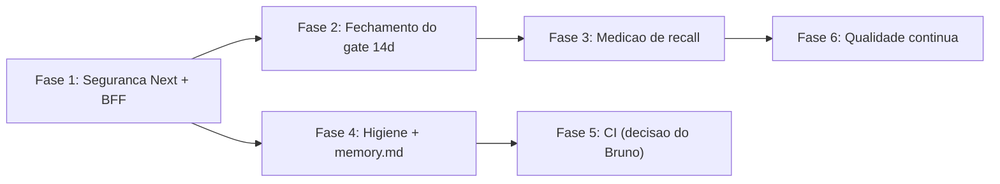

# Plano de melhorias — análise geral (28/09/2026)

Origem: análise geral do projeto a partir do [memory.md](../memory.md) e verificação no código em 28/09/2026.

Estado verificado no início do plano:

- Backend: `432 passed` em ~9 s (`backend/.venv`), 7 warnings.
- Frontend: `tsc --noEmit` sem erros.
- `npm audit --omit=dev`: 1 crítica (`next@14.2.21`), 2 altas (`postcss`, `nanoid`).
- CI: `.github/workflows/ci.yml.disabled` (desligado em `f920da5`).
- Portas do Compose presas em `127.0.0.1` (db 5432, backend 8000, frontend 3000).

Princípio: nenhuma funcionalidade nova. O foco é segurança, medição de qualidade e redução de ruído operacional.



---

## Fase 1 — Segurança do frontend e do BFF (prioridade alta)

Branch: `fix/seguranca-next-bff`

### 1.1 Atualizar Next.js para 14.2.35

Motivo: `next@14.2.21` tem vulnerabilidade crítica (SSRF em redirect de middleware, confusão de cache e injeção de conteúdo no Image Optimization, exposição de informação no dev server). A última da linha 14.2 é `14.2.35`. Migração para Next 15 fica fora deste plano (React 19 + `params` assíncronos exigem ajuste em todas as rotas dinâmicas).

Passos:

1. Em [frontend/package.json](../frontend/package.json): `next` e `eslint-config-next` para `14.2.35`.
2. `npm install` e `npm audit fix` (sem `--force`) para `postcss` e `nanoid`.
3. Rodar `npm audit --omit=dev` e registrar o que restar, com justificativa.

Aceite: `npm audit --omit=dev` sem crítica; `tsc --noEmit` limpo; `next build` ok; `./scripts/up.sh --build` com 4 containers healthy.

### 1.2 Proteger o proxy BFF contra requisição de outra origem (CSRF)

Arquivo: [frontend/src/app/api/proxy/[...path]/route.ts](../frontend/src/app/api/proxy/[...path]/route.ts)

Problema: o proxy injeta `X-API-Token` em qualquer requisição. Uma página maliciosa aberta no mesmo navegador pode disparar `POST` simples (form/multipart) para `127.0.0.1:3000/api/proxy/...` e iniciar análise (gasta cota), enviar arquivo ou disparar `/comparison/{id}/feedback` (e-mail).

Correção (antes de montar o `targetUrl`):

```ts
function isSameOrigin(request: NextRequest): boolean {
  const site = request.headers.get('sec-fetch-site');
  if (site) return site === 'same-origin' || site === 'none';
  const origin = request.headers.get('origin');
  if (!origin) return request.method === 'GET' || request.method === 'HEAD';
  return origin === request.nextUrl.origin;
}

if (!isSameOrigin(request)) {
  return NextResponse.json({ detail: 'Origem não permitida.' }, { status: 403 });
}
```

Atenção à extensão SEI ([extension/](../extension/)): ela chama o BFF em `:3000/api/proxy`. Requisições de extensão chegam com `Origin: chrome-extension://<id>`. Incluir allowlist opcional por env (`BFF_ALLOWED_ORIGINS`, lista separada por vírgula) em vez de liberar qualquer `chrome-extension://`.

### 1.3 Não vazar mensagem interna no 502

No `catch` do mesmo arquivo, trocar `err.message` por mensagem fixa (`'Falha ao contatar o backend.'`) e registrar o erro real com `console.error` no servidor.

### 1.4 Remover rewrite legado `/api/v1/:path*`

Arquivo: [frontend/next.config.js](../frontend/next.config.js). O rewrite vai direto ao backend sem token (sempre 401 fora de development) e confunde o diagnóstico. Antes de remover: `rg "'/api/v1" frontend/src extension` deve voltar vazio. Manter `/health`, `/livez`, `/readyz`.

### 1.5 Testes

- Playwright novo `frontend/e2e/bff-origin.spec.ts`: `POST` com `Origin: https://evil.example` retorna 403; mesma origem continua funcionando (reusar padrão de [frontend/e2e/bff-lists.spec.ts](../frontend/e2e/bff-lists.spec.ts)).
- Regressão: `E2E_LIVE=1` smoke (`smoke.spec.ts`, `bff-lists.spec.ts`, `upload-tr.spec.ts`).
- Manual: extensão SEI ainda consegue baixar `corrected-html` com a origem na allowlist.

Commit: `fix(seguranca): next 14.2.35 + bff valida origem`.

---

## Fase 2 — Fechar o gate de 14 dias (prioridade alta, humano + doc)

O gate em [docs/ops/gate-piloto-14d.md](ops/gate-piloto-14d.md) está com status "janela aberta" e termina hoje (28/09).

Passos:

1. Bruno revisa os 5 achados altos pendentes do job `8cdafd60` (incluindo DDR da alínea "e") e o item 1.1.
2. Colar o pacote SEI (HTML/DOCX) em minuta de teste no SEI real e anotar o resultado.
3. Preencher a tabela de métricas do gate e registrar a decisão: **Go**, **Go com ressalvas** ou **No-Go**, com motivo.
4. Atualizar o status do gate no doc e uma linha no `memory.md`.

Aceite: doc do gate com decisão datada; pendências remanescentes listadas.

---

## Fase 3 — Medir recall em TR real (prioridade alta)

Motivo: precisão tem várias travas (gate de evidência, revisão cruzada, supervisor, NIT), mas o recall é desconhecido em produção (golden Groq R 0,56). Sem essa medida, não dá para decidir entre miss-hunter, provedor pago ou tuning de prompt.

Branch: `feat/recall-tr-real`

Passos:

1. Escolher o TR `09-ti-pabx-nuvem` (já analisado várias vezes).
2. Bruno anota a lista de problemas reais esperados (item, categoria, severidade) em `e2e/golden/real/tr_pabx.json`, no mesmo formato de [e2e/golden/tr_001.json](../e2e/golden/tr_001.json). O arquivo fica fora do Git se contiver texto sensível (adicionar ao `.gitignore`).
3. Adaptar [backend/scripts/benchmark.py](../backend/scripts/benchmark.py) para aceitar `--golden e2e/golden/real/tr_pabx.json` e comparar com uma análise existente por `analysis_id`, sem nova chamada LLM (modo offline).
4. Rodar três medições: análise atual; análise com `MISS_HUNTER_ENABLED=true`; (opcional) um provedor pago se houver chave.
5. Registrar resultado em `docs/ops/recall-tr-real-2026-09.md` com decisão: ligar miss-hunter por padrão ou não; precisa de provedor pago ou não.

Aceite: recall e precisão medidos no TR real, com decisão documentada. Meta de referência: recall >= 0,70 sem cair precisão abaixo de 0,80.

---

## Fase 4 — Higiene do repositório e do memory.md (prioridade média)

Branch: `chore/higiene-memory`

### 4.1 Limpeza de arquivos soltos

1. `git worktree remove .kilo/worktrees/fire-jasper` (detached em `45d8225`, 4,6 MB).
2. Remover `licitacao.db` da raiz (SQLite legado de 26/08). Antes: confirmar que nenhum `.env`/script aponta para ele (`rg licitacao.db`).
3. Limpar `tmp/`, `e2e-uploads/`, `.pytest_cache/`, `e2e/tests/__pycache__/`.
4. Adicionar `.kilo/` ao [.gitignore](../.gitignore).

### 4.2 Warning de thread na suíte

`backend/tests/test_sei_pack_and_priority.py::test_corrected_html_aplica_replace` gera `RuntimeError: Event loop is closed` em thread (aparece como `PytestUnhandledThreadExceptionWarning`). Causa provável: engine/sessão async não descartado antes do fim do loop. Corrigir com `await engine.dispose()` na fixture (mesmo padrão já aplicado nos testes de chat/review em 21/09).

Aceite: `pytest -W error::pytest.PytestUnhandledThreadExceptionWarning` passa.

### 4.3 Consolidar o memory.md

Problema: 110 KB, 690 linhas, com contradições (Python 3.12 "corrompido" e "reparado"; CI "desabilitado" e "religar"; contagens antigas 159/215/261 testes; blocos repetidos de 13/08 e do Copiloto; parágrafos de 1 linha com milhares de caracteres nas linhas 660–690).

Nova estrutura (meta: ~150–200 linhas):

1. Visão geral e job do piloto (curto).
2. Arquitetura atual (stack, serviços, fluxo upload → worker → análise → SEI).
3. Regras invioláveis (sigilo fail-closed, cópia SEI só `aprovada|ajustada`, TCU em quarentena, worker obrigatório, CI só com pedido).
4. Estado atual (data, suíte, schema head, provedores ativos, flags relevantes).
5. Como executar (Docker e local, um bloco cada).
6. Pendências abertas (lista única, sem duplicar tabela de 10/09).
7. Armadilhas conhecidas (bugs recorrentes de ambiente, 1 linha cada).

Histórico cronológico completo vai para `docs/archive/historico-memory-ate-2026-09-28.md` (movido, não apagado).

Aceite: nenhuma contradição entre seções; todos os links relativos válidos.

### 4.4 Arquivos acima de 300 linhas

Sem refatoração especulativa. Registrar no memory.md a regra: ao tocar em um destes, extrair módulo no mesmo PR:

- `backend/app/services/llm/provider.py` (376)
- `backend/app/services/analyzer/evidence_gate.py` (352)
- `backend/app/services/rag/loader.py` (339)
- `backend/app/services/rag/semantic.py` (323)
- `backend/app/services/analyzer/analysis_phases.py` (319)
- `backend/app/services/analyzer/analysis_persistence.py` (315)
- `frontend/src/app/analysis/[id]/useAnalysisPage.ts` (312)
- `backend/app/api/documents.py` (311)

Commit: `chore(higiene): limpa worktree/legado + consolida memory`.

---

## Fase 5 — CI (depende de decisão do Bruno)

O memory.md registra "não reabilitar sem pedido explícito". Proposta de gate mínimo, sem LLM e sem secrets:

1. Renomear `.github/workflows/ci.yml.disabled` para `ci.yml` mantendo só o job `backend` (ruff + pytest + cobertura 70) e adicionar job `frontend` (`npm ci`, `tsc --noEmit`, `npm audit --omit=dev --audit-level=critical`).
2. Deixar `eval-rag` como `workflow_dispatch` (manual).
3. Garantir `ruff` em `backend/requirements-dev.txt` (hoje só existe em `~/.local/bin`, fora do venv).

Aceite: pipeline verde no push em `main` em menos de 5 min.

---

## Fase 6 — Qualidade contínua (prioridade baixa)

1. **Testes unitários do frontend** com Vitest para lógica pura de `frontend/src/lib/`: `polling.ts`, `priorityQueue.ts`, `diffDisplay.ts`, `chatAnswer.ts`, `placeholderText.ts`. Script `npm run test`.
2. **Provedor pago de último recurso** (só se a Fase 3 mostrar que free tier limita o recall): `AnthropicProvider` com teto de gasto baixo, entrando no fim da cadeia de failover; seguir plano já descrito no memory.md (Batch API).
3. **Auditoria de dependências mensal**: `npm audit` + `pip-audit` registrados em `docs/ops/`.

---

## Resumo de branches e ordem

1. `fix/seguranca-next-bff` — Fase 1 (hoje).
2. Fase 2 — documento do gate (hoje, sem branch de código).
3. `feat/recall-tr-real` — Fase 3.
4. `chore/higiene-memory` — Fase 4 (pode rodar em paralelo à 3).
5. `ci/gate-minimo` — Fase 5, só com autorização.
6. Fase 6 conforme resultado da Fase 3.

## Fora de escopo

Multiusuário/OIDC, migração para Next 15/React 19, troca de ORM ou banco, fine-tune, K8s, tirar TCU da quarentena.
