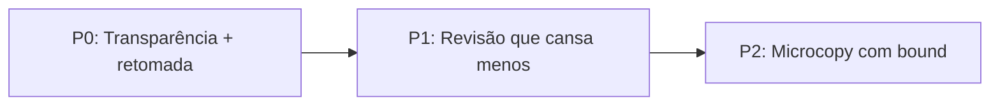

# Plano UX-Confiança — elevar UX/honestidade de 8,0 para 9,0 (28/09/2026, rev.2)

Objetivo: fazer a incerteza ficar visível e o trabalho do revisor ficar menor.
Nenhuma mudança de backend, nenhum modelo novo, nenhuma promessa absoluta nova.
Princípio: toda afirmação da UI sobre qualidade vem de número medido e linkado.

Síntese de 2 revisões externas (DeepSeek + Grok) + verificação no código em
28/09: todos os buracos abaixo foram provados no repo antes de entrar aqui.
Decisões pendentes do Bruno marcadas com **[DECISÃO]**.



Branch única: `feat/ux-confianca` (commits por fase). **9,0 = gate da branch
inteira** — P0 sozinho não entrega "revisa sem se perder" nem "nenhuma tela
promete adequação". QA da branch NÃO roda em paralelo com a anotação dos 17
pendentes do golden (disputam as mesmas horas).

---

## P0 — Transparência + retomada (o que fecha o 9,0)

### 0.1 Página `/confianca` — detalhe; o 9,0 fecha no relatório/análise

A rota existe como detalhe linkado. O que conta para o 9,0 é a faixa calibrada
visível onde o revisor já trabalha (0.2). Não duplicar ajuda: `/guia` continua
sendo "como usar"; header/rodapé do relatório apontam "Como confiamos".

Dados em `frontend/src/lib/confidence.ts`, schema obrigatório:

```ts
interface ConfidenceBlock { value: string; source: string; lastUpdated: string; status: 'medido' | 'harness' | 'ausente'; }
```

Números a gravar (fonte canônica = `docs/ops/recall-tr-real-2026-09.md`, que
vence o `memory.md` em caso de divergência):

- Recall **0,25 (3/12)** rotulado "validação de harness, carimbo pendente".
  Proibidos: 0,67/0,00 do memory e P 1,0 do Groq.
- Precisão: **"ainda não medido neste golden (carimbo pendente)"**.
- Dono e gatilho: quem reescreve a fonte única e em qual evento (nova medição
  no ops ou carimbo no golden) — sem isso a página mente na medição seguinte.

Anti-obsolescência: se `lastUpdated > 30 dias`, banner "números
desatualizados" (staleness gate). Bloco sem medição renderiza "ainda não
medido" + link, nunca zero. Texto de limites versionado em `copy.ts` com data.

Aceite: rota renderiza sem backend; `tsc` limpo; Playwright
`confianca.spec.ts` (5 blocos: precisão, recall, limites, cobertura, histórico;
fonte linkada em cada um; banner de staleness simulável).

### 0.2 Nota e parecer calibrados (relatório + análise)

Prova no código: `ReportResponse` **não** tem cobertura (só `status`); cobertura
(`analyzed_items`/`total_items`) vive em `AnalysisDetailResponse`; o banner
`completed_with_errors` vive em `/analysis/[id]`, não no relatório. Logo:

- Página de relatório chama **também** o detalhe da análise (já existente) e
  lê cobertura + status de lá. Threshold explícito: cobertura **< 95%** →
  faixa + ressalva; 100% → nota direta. Com cobertura baixa, mostrar faixa
  ("entre 6 e 9,3") ou "análise parcial" em vez do score seco.
- Ressalva **inline e colada visualmente** ao número (não só link) + CSS de
  impressão com a ressalva embutida (print não pode decapitar o contexto).
- Envolver o parecer bruto com o mesmo aviso (o botão copia esse texto p/ o
  SEI — honestidade na tela com minuta absoluta é meia honestidade; residual
  documentado ou aviso na ação de copiar — **[DECISÃO]** qual dos dois).
- Calibrar **dentro de `ReportScores`** (não criar `CalibratedVerdict.tsx`).
  Incluir banner da análise + rota `/analysis/[id]` no escopo (o exemplo
  9,3 + 186/257 misturava dois jobs — nunca misturar runs).

Aceite: relatório parcial nunca afirma adequação geral (teste Vitest dos 3
estados do score); `tsc` limpo; Playwright da faixa calibrada (mock).

### 0.3 Retomada por ID (subiu de P1 — sem ela o 9,0 não fecha)

Prova no código: `GuidedReview` filtra pendentes prioritários e a lista
**encolhe** a cada decisão; `idx` + barra `i/total` sobre lista mutável retomam
o card errado. Correção:

- Persistir o **id da correção** (`licitai-review-{analysisId}`), não o índice.
  No load: id ainda pendente → abre esse card; senão, primeiro pendente.
- "X de Y" = revisados / **correções prioritárias** (Y estável, independente do
  filtro). Definir "revisável" na UI ("X de Y itens revisáveis").
- Guiado continua só-pendentes com **contador** ("3 pendentes"); "ver todas"
  sai do guiado e não lê nem grava retomada. Bound: mesmo browser, single-user
  (sem outro perfil, sem modo privado). Botão "recomeçar do topo" + fallback
  com storage vazio/corrompido.

Aceite: recarregar retoma o card certo; Playwright de retomada (mock);
`tsc` limpo.

---

## P1 — Revisão que cansa menos

### 1.1 Evidência visível por correção

Contrato verificado: `evidence` entrega `grounded` e `legal_valid`;
`claim_support` vive no **topo da correção** (não em `evidence`). Logo, sem
backend:

- Chips via `copy.ts` (nunca jargão cru): "trecho confirmado no TR",
  "base legal válida", "2/2 afirmações verificadas".
- Três estados sempre visíveis (verdadeiro/falso/ausente); ausência vira
  "evidência não registrada nesta análise" + "por quê?", nunca vazio.

Aceite: 3 estados renderizam; `tsc` limpo.

### 1.2 Teclado completo (com Ajustar e undo)

A revisão tem 3 ações; placeholder bloqueia aprovar e abre ajuste. Regras:

- `a` aprovar · `r` rejeitar · `j` abrir Ajustar e focar o campo · `n` próximo
  (nunca conta como decisão). Com placeholder, `a` abre Ajustar em vez de aprovar.
- Guards: ignorar em campo de texto, dentro de dialog (Copiloto compete),
  com `ctrl/meta/alt` pressionados e em ponteiro grosso (só botões).
- **Undo**: toast "desfazer" 5s após cada decisão (a/r acidental é irreversível).
- Foco: após decidir, wrapper do próximo card (`CorrectionCard` remonta com
  `key` — o skip-link não serve); vazio → "Ver todas".
- `?` alterna disclosure no rodapé (não modal); `aria-keyshortcuts` +
  `aria-live` no feedback.

Aceite: Playwright de teclado (mock) incl. Ajustar, undo e guards; `tsc` limpo.

---

## P2 — Microcopy com bound

Bound: **só copy que afirma adequação/completude** (relatório + banners). Não
varrer lista vazia genérica nem nomes de env (evita `copy.ts` gigante).

1. Inventário: `rg -g '*.tsx' -g '*.ts' -e 'adequ|complet|garant|100%|sempre|todos os itens' frontend/src`
   + mapeamento de **erros da API** que vazam jargão + padronização pt-BR de
   datas/números. Incluir o próprio `copy.ts` no grep.
2. Reescrever em PT-BR de elaborador, cada uma com próximo passo.

Aceite: zero afirmação absoluta em texto visível; `tsc` limpo.

---

## Gates de saída

- `npm run test` (Vitest, incl. estados do score) · `tsc --noEmit` ·
  Playwright (faixa calibrada + teclado + retomada, mock) · `next build` via
  `./scripts/up.sh --build`.
- A11y: `@axe-core/playwright` (ou pa11y) nos fluxos tocados.
- Métrica de sucesso (lightweight, sem telemetria invasiva): **tempo de
  revisão** e **taxa de undo** antes/depois + 1 revisor não-técnico em 3
  tarefas (sim/não). QA em TR maior (ex.: job 257 itens) p/ progresso/retomada.

## Critério de 9,0 (falsificável)

1. Revisor novo entende os limites sem explicação (teste de usabilidade curto).
2. Revisa 17 itens sem se perder (progresso + retomada + teclado medidos).
3. Nenhuma tela promete adequação absoluta (varredura P2).

## **[DECISÃO]** pendentes do Bruno

1. Rota `/confianca` como detalhe + faixa no fluxo (opção 2) vs cortar a rota.
2. Aviso na ação de copiar parecer vs residual aceito documentado.
3. QA desta branch após (não em paralelo com) o carimbo dos 17.

## Fora de escopo

Reescrever score/parecer no backend; mudar `evidence` da API; novo modelo;
Next 15; multiusuário; mudar regra de negócio da fila; `Anterior` reabrir
revisado (indefinido — não mexer).
